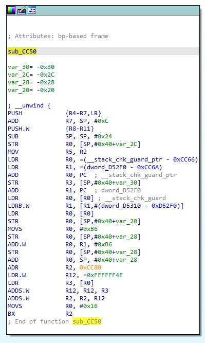
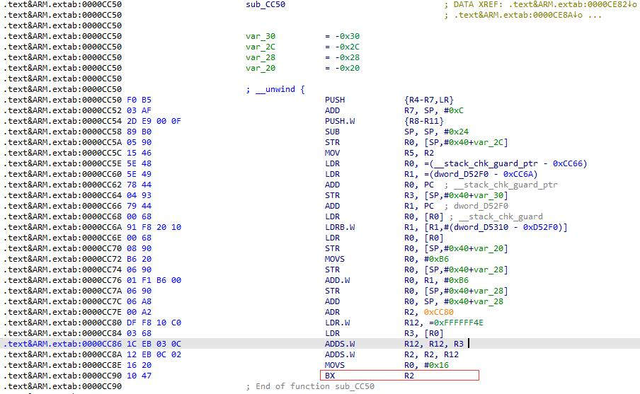
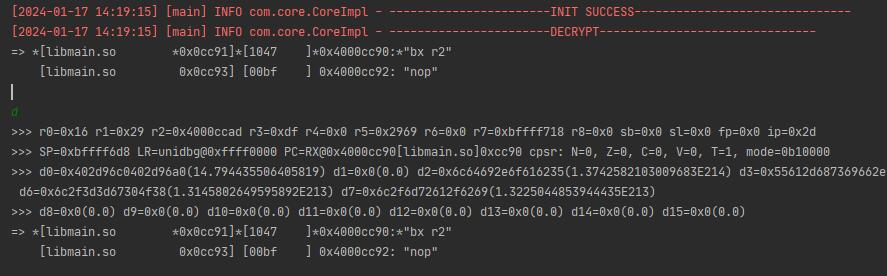
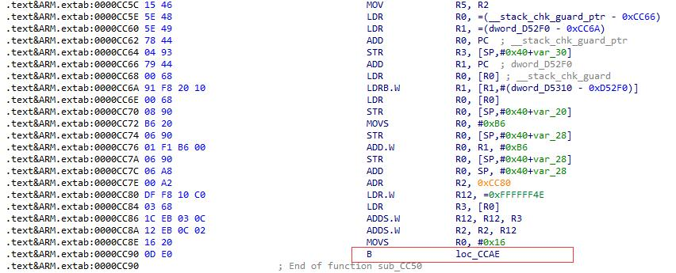
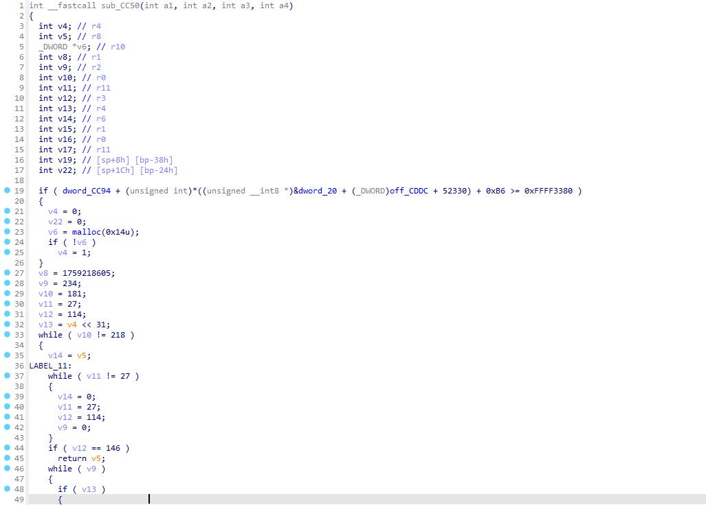
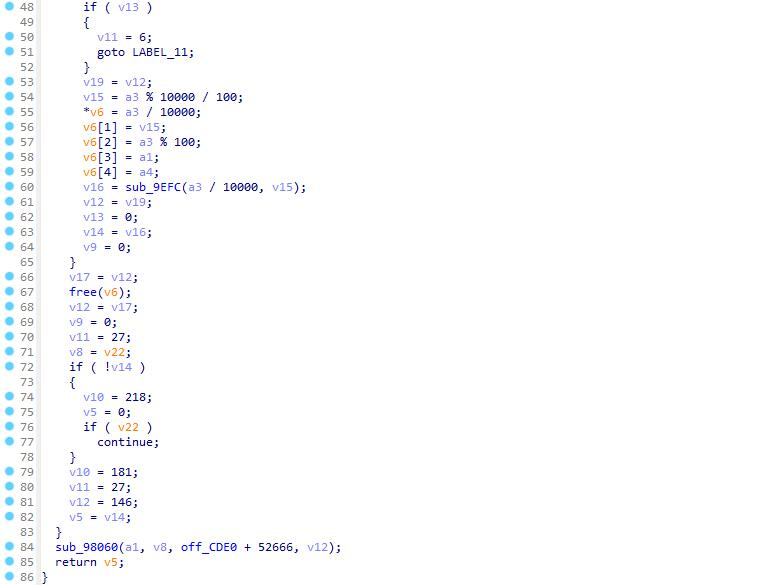

# IdleFish_SellerId_Algorithm
探寻闲鱼SellerId加解密算法(2) 还原C代码

```
前几天实现了闲鱼SellerId加密还原，但原理还是基于Unidbg调用闲鱼的so文件，按程序执行方式执行的解密操作。

这种实现的弊端在于无法还原真正的算法，而且想在此基础上逆向算法，比如将明文加密，甚至是学习算法细节，就很是不足了。

所以继续尝试在执行的过程中，还原出整个算法的代码。

那么，今天的内容来了。

郑重声明：

1、此版本代码系阿里已经更新换代过的产品，目前已经不再正式使用。

2、此文章内容仅供参考学习，如果有人使用相关代码，或者在相关代码基础上开发其他应用，需要承担因此产生的所有责任。

```

## 1、核心。

其实不仅仅是闲鱼，整个阿里系的应用在算法架构上面都差不太多，也就是所谓的阿里聚安全。

整个算法的核心，都在于libsgmain.so。区别就是版本不同，对于so文件的保护不同。

而所有方法的核心就在于JNI调用的 com.taobao.wireless.security.adapter.JNICLibrary->doCommandNative 方法。

## 2、获取偏移地址

我们通过hook RegisterNatives获取此方法的偏移地址：

hookRegisterNatives代码：

```js
function find_RegisterNatives(params) {
    var symbols = Module.enumerateSymbolsSync("libart.so");
    var addrRegisterNatives = null;
    for (var i = 0; i < symbols.length; i++) {
        var symbol = symbols[i];
 
        //_ZN3art3JNI15RegisterNativesEP7_JNIEnvP7_jclassPK15JNINativeMethodi
        if (symbol.name.indexOf("art") >= 0 &&
                symbol.name.indexOf("JNI") >= 0 &&
                symbol.name.indexOf("RegisterNatives") >= 0 &&
                symbol.name.indexOf("CheckJNI") < 0) {
            addrRegisterNatives = symbol.address;
            console.log("RegisterNatives is at ", symbol.address, symbol.name);
            hook_RegisterNatives(addrRegisterNatives)
        }
    }
}
 
function hook_RegisterNatives(addrRegisterNatives) {
 
    if (addrRegisterNatives != null) {
        Interceptor.attach(addrRegisterNatives, {
            onEnter: function (args) {
                console.log("[RegisterNatives] method_count:", args[3]);
                var java_class = args[1];
                var class_name = Java.vm.tryGetEnv().getClassName(java_class);
                //console.log(class_name);
 
                var methods_ptr = ptr(args[2]);
 
                var method_count = parseInt(args[3]);
                for (var i = 0; i < method_count; i++) {
                    var name_ptr = Memory.readPointer(methods_ptr.add(i * Process.pointerSize * 3));
                    var sig_ptr = Memory.readPointer(methods_ptr.add(i * Process.pointerSize * 3 + Process.pointerSize));
                    var fnPtr_ptr = Memory.readPointer(methods_ptr.add(i * Process.pointerSize * 3 + Process.pointerSize * 2));
 
                    var name = Memory.readCString(name_ptr);
                    var sig = Memory.readCString(sig_ptr);
                    var symbol = DebugSymbol.fromAddress(fnPtr_ptr)
                    console.log(
                        "[RegisterNatives] java_class:",
                        class_name,
                        "name:",
                        name,
                        "sig:",
                        sig,
                        "fnPtr:",
                        fnPtr_ptr,
                        " fnOffset:",
                        symbol,
                        " callee:",
                        DebugSymbol.fromAddress(this.returnAddress)
                    );
                }
            }
        });
    }
}
 
setImmediate(find_RegisterNatives);


```

结果为：

```
[RegisterNatives] java_class: com.taobao.wireless.security.adapter.JNICLibrary name: doCommandNative sig: (I[Ljava/lang/Object;)Ljava/lang/Object; fnPtr: 0xbf2ddc51  fnOffset: 0xbf2ddc51 libsgmainso-6.5.24.so!0xcc51  callee: 0xbf2dde9f libsgmainso-6.5.24.so!0xce9f

```

得到偏移地址为：0xcc51

## 3、大杀器 IDA

获取了偏移地址后，就可以直接到偏移地址 0xcc51。



已经很亲切了吧。

但对于一个普通程序员来说，这还不够，还是有点吃力怎么办。

那就是还原成C代码啊。



但目前有个问题，sub_CC50这个函数的0xCC90位置，BX R2， R2为动态跳转。IDA无法自动F5。所以我们需要先确定此时R2的值，将其Patch成固定跳转，就可以进一步实现了。

说干就干...

## 4、获取R2的值

在Unidbg相关位置下断点或者用frida在相关位置断点打印。

不过既然我们已经Unidbg实现了相关代码，那用Unidbg就方便很多了：



可以看到此时R2的值为 0x4000ccad， 而Unidbg默认基址为 0x40000000。所以此时R2跳转的相对地址为：0xCCAD + 1 = 0xCCAE。

## 5、Patch， 然后大功告成。



那么接下来，就是见证奇迹的时刻了：





